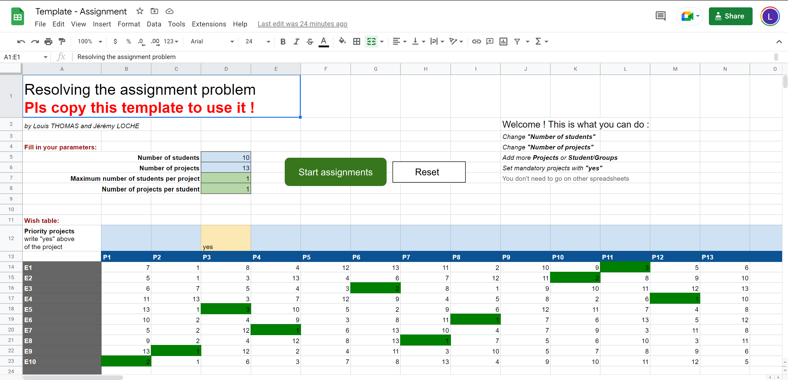

# Students/Projects assignment problem

You can now solve easily the assignement conficts you get when student needs to choose projects.

- Google Apps Script code : https://github.com/louisthomaspro/assignment-gscript
- Project report : [Report_LOCHE_THOMAS_3A_DII12.pdf](/Latex%20Report/Report_LOCHE_THOMAS_3A_DII12.pdf)

## How to use

- Open the following URL: https://docs.google.com/spreadsheets/d/1pu3gEb227M-ipbj6lvv1rBgDO-wZK2A2jnz5SO4AFdc
- Make a copy
- Add the students/class pairs and the projects
- Share the Google Sheets to the students and let them vote by giving the order of preference for each project
- Once the sheet is completed, adjust the parameters and click on "Start assignement"
